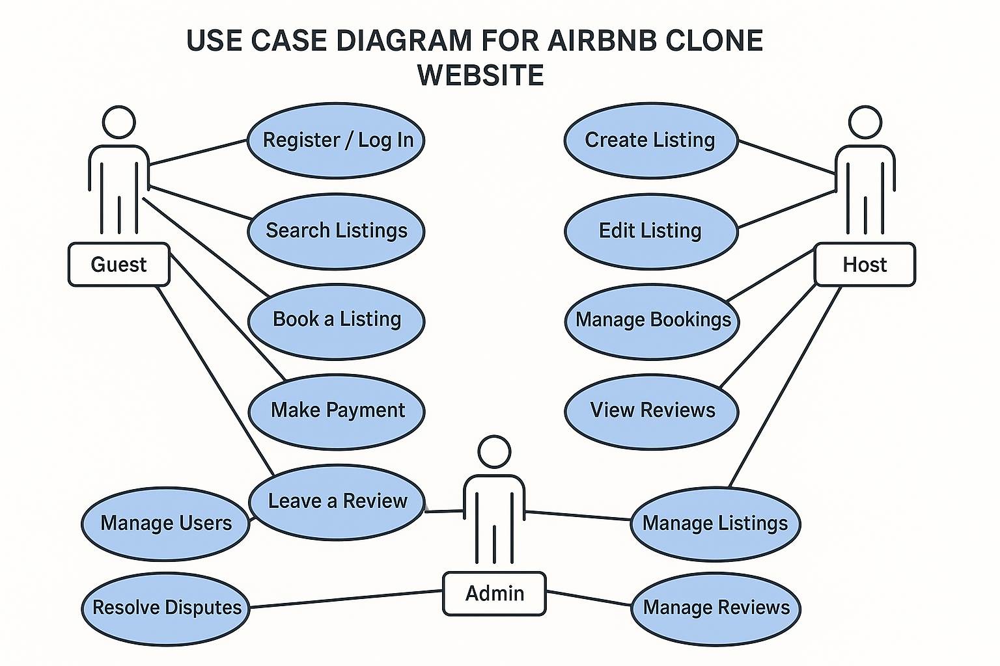

# Requirement Analysis in Software Development.

## 📘 Introduction

Welcome to the **Requirement Analysis Project** repository.  
This project serves as a foundational step in the software development lifecycle, focusing on documenting and analyzing the requirements for a **Booking Management System**.

It simulates a real-world development scenario to help learners understand and practice how to gather, structure, and present software requirements effectively. The goal is to ensure **clarity**, **precision**, and **completeness** in the requirement analysis phase, setting the stage for a successful development process.
## ❓ What is Requirement Analysis?

**Requirement Analysis** is a critical phase in the Software Development Life Cycle (SDLC) where the needs and expectations of stakeholders are gathered, analyzed, and clearly documented. It acts as the foundation upon which all subsequent stages of development are built.

During this phase, business analysts, project managers, and developers work closely with clients or end-users to understand what the software system must accomplish. The result is a set of well-defined functional and non-functional requirements that guide the design, development, and testing processes.

### 🔍 Key Activities in Requirement Analysis:
- **Requirement Gathering**: Collecting information from stakeholders through interviews, questionnaires, observations, or document analysis.
- **Requirement Categorization**: Classifying requirements into functional (what the system should do) and non-functional (how the system should behave) groups.
- **Requirement Documentation**: Creating clear and structured documentation, such as Software Requirement Specifications (SRS), use cases, and user stories.
- **Requirement Validation**: Ensuring the requirements are complete, consistent, feasible, and in alignment with business goals.

### 🚀 Importance in SDLC:
- **Prevents Miscommunication**: Clear requirements reduce ambiguity and ensure that all stakeholders have a shared understanding of project goals.
- **Improves Project Planning**: Well-defined requirements help in accurate estimation of resources, timelines, and budgets.
- **Minimizes Risk**: Early identification of constraints or technical challenges reduces costly changes in later phases.
- **Enhances Product Quality**: Proper analysis leads to building the right product that meets user expectations and business needs.

In essence, **requirement analysis** sets the stage for all other stages of the SDLC, and its success greatly influences the success of the overall project.
## ✅ Why is Requirement Analysis Important?

Requirement Analysis is one of the most crucial phases in the Software Development Life Cycle (SDLC). It provides a clear roadmap for the entire project and ensures that the final product meets the actual needs of its users and stakeholders. Here are three key reasons why Requirement Analysis is essential:

### 1. 🧭 Clear Project Direction
Requirement analysis defines *what* needs to be built and *why*. By understanding user needs and business objectives from the start, development teams can stay aligned throughout the project, reducing confusion and misalignment.

### 2. 💸 Cost and Time Efficiency
Identifying and resolving misunderstandings or incomplete requirements early in the process helps avoid expensive changes or rework later in the development cycle. It enables better estimation of project scope, timelines, and resources.

### 3. 🛡️ Risk Mitigation
Thorough analysis highlights potential risks, constraints, and dependencies before development begins. This proactive approach helps in addressing issues early, reducing the chances of project failure or scope creep.

Requirement Analysis acts as the blueprint for your software project—without it, the development process is prone to delays, misunderstandings, and missed goals.
## 🔑 Key Activities in Requirement Analysis

The Requirement Analysis phase involves several critical activities that ensure a clear and complete understanding of what the software system must accomplish. Below are the five key activities involved:

- **📝 Requirement Gathering**  
  This is the initial step where information is collected from stakeholders, users, and other sources. Techniques include interviews, surveys, observation, and reviewing existing documentation. The goal is to identify and collect all potential requirements.

- **💬 Requirement Elicitation**  
  This involves engaging with stakeholders to draw out detailed and specific requirements. It’s a more interactive and iterative process than gathering, focusing on clarifying and understanding needs, expectations, and constraints through workshops, brainstorming, and use cases.

- **📄 Requirement Documentation**  
  All gathered and elicited requirements are then clearly documented in a structured format. This documentation serves as a reference for developers, testers, and stakeholders throughout the project. Common formats include Software Requirements Specification (SRS), user stories, and functional specifications.

- **📊 Requirement Analysis and Modeling**  
  At this stage, the requirements are critically examined for consistency, feasibility, and completeness. Modeling tools like data flow diagrams, UML diagrams, or flowcharts may be used to visualize and better understand system behavior and interactions.

- **✅ Requirement Validation**  
  This step ensures that the documented requirements are accurate, complete, and aligned with business goals. Validation involves reviewing requirements with stakeholders and using techniques such as walkthroughs, reviews, and prototyping to confirm correctness.

Each of these activities contributes to building a solid foundation for a successful software development process by ensuring the right product is built for the right reasons.
## 📂 Types of Requirements

In the context of software development, requirements are generally classified into two main categories: **Functional Requirements** and **Non-functional Requirements**. Both are essential for defining what the system should do and how it should perform.

### 🔧 Functional Requirements

Functional requirements describe the **specific behaviors, features, and functions** that a system must perform. These are the core features that enable the system to fulfill its intended purpose.

#### Examples for the Booking Management System:
- Users should be able to create, update, and cancel bookings.
- Admins should be able to view all bookings in a centralized dashboard.
- The system should send confirmation emails after a successful booking.
- Users must be able to search for available slots based on date and time.
- The system should support user authentication and role-based access (e.g., admin vs. customer).

### ⚙️ Non-functional Requirements

Non-functional requirements define the **quality attributes, constraints, and performance standards** of the system. These requirements describe how the system performs its functions rather than what it does.

#### Examples for the Booking Management System:
- The system should be available 99.9% of the time (high availability).
- Response time for any user action should not exceed 2 seconds.
- The system should be accessible via mobile and desktop devices (responsive design).
- All user data must be stored securely and comply with data protection regulations (e.g., GDPR).
- The system should support up to 10,000 concurrent users without performance degradation.

Understanding and documenting both types of requirements is essential to ensure a well-functioning and user-friendly system.
🧩 Use Case Diagrams

**Use Case Diagrams** are a type of Unified Modeling Language (UML) diagram used to represent the functional interactions between users (actors) and a system. They provide a high-level overview of what the system does from the user's perspective.

### 📌 Benefits of Use Case Diagrams:
- Clarify the system’s functional requirements.
- Identify all user interactions with the system.
- Enhance communication between stakeholders, developers, and testers.
- Provide a visual understanding of the system’s scope.

### 🖼️ Booking Management System – Use Case Diagram

The diagram below illustrates the primary actors and use cases for the **Booking Management System**.

### 👥 Actors:
- **Customer** – Can search availability, make bookings, modify or cancel bookings.
- **Admin** – Manages bookings, views reports, handles user accounts.

### 🎯 Key Use Cases:
- Search for availability
- Make a booking
- Modify a booking
- Cancel a booking
- Receive confirmation
- Manage users
- Generate reports
